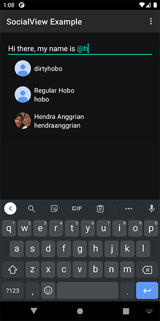
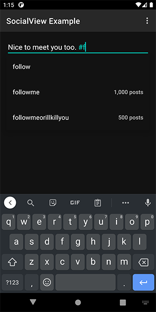

[](https://search.maven.org/artifact/com.hendraanggrian/socialview)
[](https://www.travis-ci.com/github/hendraanggrian/socialview)
[](https://github.com/hendraanggrian/socialview/blob/main/LICENSE)

SocialView
==========



TextView and EditText with hashtag, mention, and hyperlink support.
* Pre-loaded with default views, but also installable to any custom view.
* Display hashtag and mention suggestions as you type.

Download
--------

```gradle
repositories {
    mavenCentral()
    google()
}

dependencies {
    implementation "com.hendraanggrian.appcompat:socialview:$version" // base library
    implementation "com.hendraanggrian.appcompat:socialview-commons:$version" // auto-complete hashtag and mention
}
```

Snapshots of the development version are available in [Sonatype's snapshots repository](https://s01.oss.sonatype.org/content/repositories/snapshots/).

Core
----


Write `SocialTextView` or `SocialEditText` in xml.

```xml
<com.hendraanggrian.appcompat.widget.SocialTextView
    android:id="@+id/textView"
    android:layout_width="match_parent"
    android:layout_height="wrap_content"
    android:text="#hashtag and @mention."
    app:socialFlags="hashtag|mention"
    app:hashtagColor="@color/blue"
    app:mentionColor="@color/red"/>
```

See [attrs.xml](https://github.com/HendraAnggrian/socialview/blob/master/socialview/res/values/attrs.xml) for full list of available attributes.

Modify its state and set listeners programmatically.

```java
textView.setMentionEnabled(false);
textView.setHashtagColor(Color.RED);
textView.setOnHashtagClickListener(new Function2<SocialView, String, Unit>() {
    @Override
    public Unit invoke(SocialView socialView, String s) {
        // do something
        return null;
    }
});
```

Any TextView or subclasses of TextView can be made social, see [SocialTextView.kt](https://github.com/HendraAnggrian/socialview/blob/master/socialview/src/com/hendraanggrian/socialview/widget/SocialTextView.kt) for example.

Commons
-------



Write `SocialAutoCompleteTextView` in xml.

```xml
<com.hendraanggrian.appcompat.widget.SocialAutoCompleteTextView
    android:id="@+id/textView"
    android:layout_width="match_parent"
    android:layout_height="wrap_content"
    android:hint="What's on your mind?"
    app:socialFlags="hyperlink"
    app:hyperlinkColor="@color/green"/>
```

To display suggestions, it is required to `setHashtagAdapter()` and `setMentionAdapter()`.

```java
ArrayAdapter<Hashtag> hashtagAdapter = new HashtagAdapter(getContext());
hashtagAdapter.add(new Hashtag("follow"));
hashtagAdapter.add(new Hashtag("followme", 1000));
hashtagAdapter.add(new Hashtag("followmeorillkillyou", 500));
textView.setHashtagAdapter(hashtagAdapter);

ArrayAdapter<Mention> mentionAdapter = new MentionAdapter(getContext());
mentionAdapter.add(new Mention("dirtyhobo"));
mentionAdapter.add(new Mention("hobo", "Regular Hobo", R.mipmap.ic_launcher));
mentionAdapter.add(new Mention("hendraanggrian", "Hendra Anggrian", "https://avatars0.githubusercontent.com/u/11507430?v=3&s=460"));
textView.setMentionAdapter(mentionAdapter);
```

To customize hashtag or mention adapter, create a custom adapter using customized `SocialAdapter` or write your own `ArrayAdapter`.

> NOTE: Custom adapters are experimental, see sample for example.
>
```java
public class Person {
    public final String name;

    public Person(String name) {
        this.name = name;
    }
}

// easier
public class PersonAdapter extends SocialAdapter<Person> {

    public PersonAdapter(@NonNull Context context) {
        super(context, R.layout.item_person, R.id.textview_person);
    }

    @Override
    public String convertToString(Person $receiver) {
        return $receiver.name;
    }

    @Override
    public View getView(int position, View convertView, @NonNull ViewGroup parent) {
        ...
    }
}

// this works too
public class PersonAdapter extends ArrayAdapter<Person> {
    // your own adapter layout, view holder, data binding
    // and of course, filtering logic
}
```

Then, use the custom adapter.

```java
ArrayAdapter<Person> adapter = new PersonAdapter(getContext());
adapter.add(personA);
adapter.add(personB);
textView.setMentionAdapter(adapter);
```